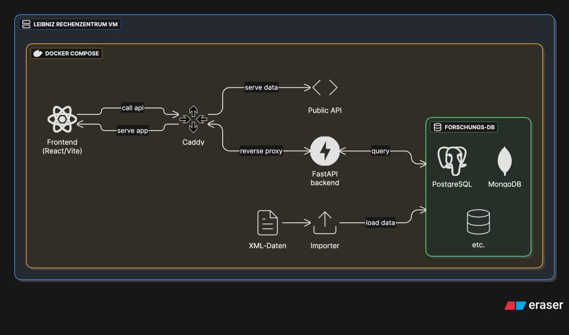

# LexoTerm Digital Infrastructure

Contains configuration and infrastructure setup for the *LexoTerm* dictionary platform deployment.

The infrastructure is distributed in [Docker][docker] containers managed via `docker compose`. Its
main components are:

1. A Python [api][api] powered by [FastAPI][fastapi]
2. A lexicographic [research application][frontend] based on TypeScript/React and [Vite][vite]
3. One or more databases holding dictionaries and corpora
4. Importers for converting, validating and storing input data in the databases
5. [Caddy][caddy] reverse proxy to manage access and SSL



## Environment Variables

The following environment variables must be set:

```sh
MONGO_INITDB_ROOT_USERNAME
MONGO_INITDB_ROOT_PASSWORD
MONGODB_URI

POSTGRES_USER
POSTGRES_PASSWORD
POSTGRES_DB

PGADMIN_DEFAULT_EMAIL
PGADMIN_DEFAULT_PASSWORD

VITE_VM_URL

BASIC_AUTH_PASSWORD
```

## Deploying

To deploy the app after pushing changes to the api and/or the frontend,

1. wait for Github CI/CD to complete
2. `ssh` into the VM
3. switch to the deploy user with `su - deploy` (enter password)
4. `cd` into ~/adl-deployment
5. `git switch main && git pull` to update to the latest configuration.

Then, run the following commands to fetch the new images and update the containers.

```sh
docker compose pull
docker compose up -d
```

## Misc

The Caddy config can be modified and reloaded without restarting the service. From within the
repo folder /home/deploy/adl-deployment, you may edit conf/Caddyfile and execute the following
command to apply it:

```sh
docker compose exec -w /etc/caddy caddy caddy reload
```

Remember to update this repo whenever you modify the setup by committing and pushing your changes.

[docker]: https://www.docker.com/
[api]: https://github.com/adl-lex/adl-api
[fastapi]: https://fastapi.tiangolo.com/
[frontend]: https://github.com/adl-lex/adl-platform
[vite]: https://vite.dev/
[caddy]: https://caddyserver.com/
